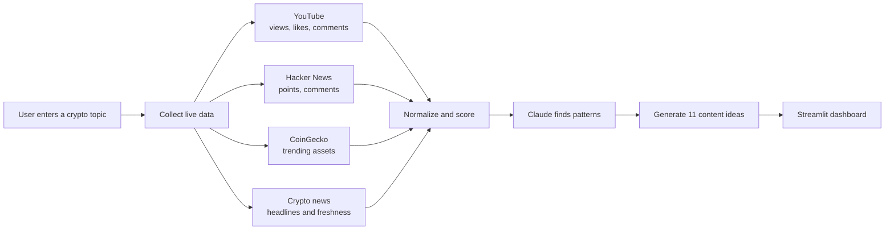

# TrendChain AI

> Turn live crypto trends into evidence-backed ideas for Instagram Reels, YouTube videos, and Twitter threads.

[](https://www.python.org/)
[](https://streamlit.io/)
[](https://www.anthropic.com/)

## Live App

**App:** [Add your Streamlit app URL here](https://your-app-name.streamlit.app)

## Demo Video

<!-- Replace the text and URL below after uploading your demo video. -->

**Watch the 3–5 minute demo:** [Demo video link coming soon](https://your-demo-video-link.com)

---

## What does it do?

A creator enters a crypto topic such as:

```text
stablecoin regulation
Bitcoin institutional adoption
Solana ecosystem
crypto tax India
```

TrendChain AI then:

1. Collects current content and engagement signals.
2. Ranks the strongest evidence.
3. Detects trending topics, viral hooks, and storytelling patterns.
4. Generates:
   - 5 Instagram Reel ideas
   - 3 YouTube video ideas
   - 3 Twitter thread ideas
5. Includes a hook, topic, angle, short outline, and source links for every idea.

## Simple Architecture



In plain English:

```text
Topic
  ↓
Live sources
  ↓
Clean and rank evidence
  ↓
Claude analyzes patterns
  ↓
Reels + YouTube + Twitter ideas
```

## Live Data Sources

| Source | What it contributes | API key |
|---|---|---|
| YouTube | Views, likes, comments, titles, descriptions | Required |
| Hacker News | Technical discussions, points, comments | Not required |
| CoinGecko | Current trending coins and categories | Recommended |
| Crypto RSS feeds | Current news headlines and narratives | Not required |
| Reddit | Optional integration pending official API approval | Optional |

X/Twitter is not used as a collection source. The system still generates the three Twitter thread ideas required by the assignment.

## How the App Works

### Live Research

- Uses current APIs and RSS feeds.
- Never silently inserts sample evidence.
- Filters YouTube, Hacker News, and news using the selected research period.
- CoinGecko always represents its current 24-hour trends.

### Demo Data

- Works without external APIs.
- Uses an explicitly labelled local sample dataset.
- Useful for evaluation when an API is unavailable.

## Project Structure

```text
crypto-pulse-ai/
├── app.py                         # Streamlit interface
├── crypto_pulse/
│   ├── collectors/
│   │   ├── youtube.py             # YouTube collection
│   │   ├── hackernews.py          # Hacker News collection
│   │   ├── coingecko.py           # CoinGecko trends
│   │   ├── news.py                # Crypto RSS feeds
│   │   └── reddit.py              # Optional Reddit collector
│   ├── pipeline.py                # Runs collectors and analysis
│   ├── scoring.py                 # Engagement and freshness scoring
│   ├── llm.py                     # Claude analysis and generation
│   ├── fallback.py                # Offline deterministic fallback
│   ├── models.py                  # Shared data models
│   └── config.py                  # Environment configuration
├── data/
│   └── sample_data.json           # Demo mode data
├── tests/                          # Automated tests
├── .env.example                   # Environment template
├── requirements.txt
└── pyproject.toml
```

---

## Run Locally

### 1. Clone the repository

```bash
git clone https://github.com/YOUR_USERNAME/crypto-pulse-ai.git
cd crypto-pulse-ai
```

### 2. Create the environment file

```bash
cp .env.example .env
```

Open `.env` and add your keys:

```dotenv
ANTHROPIC_API_KEY=your_anthropic_key
ANTHROPIC_MODEL=claude-haiku-4-5

YOUTUBE_API_KEY=your_youtube_key
COINGECKO_DEMO_API_KEY=your_coingecko_key

DEFAULT_QUERY=crypto
DEFAULT_DAYS=30
MAX_ITEMS_PER_SOURCE=20
REQUEST_TIMEOUT_SECONDS=8
```

Never commit `.env` or expose API keys in GitHub.

### 3. Install dependencies

With `uv`:

```bash
uv sync --extra dev
```

Or with Python:

```bash
python3 -m venv .venv
source .venv/bin/activate
pip install -r requirements.txt
```

### 4. Start the app

With `uv`:

```bash
uv run streamlit run app.py
```

Or:

```bash
streamlit run app.py
```

Open [http://localhost:8501](http://localhost:8501).

## How to Use It

1. Enter a specific crypto topic.
2. Select a research period.
3. Click **Generate viral content ideas**.
4. Review:
   - Content ideas
   - Trend overview
   - Viral patterns
   - Research sources
5. Download the complete JSON report if needed.

Specific queries usually produce better research:

```text
Better: stablecoin regulation India
Too broad: crypto
```

## API Setup

### Anthropic

Create an API key in the [Anthropic Console](https://console.anthropic.com/settings/keys).

Claude performs pattern detection and idea generation. If Claude is unavailable, the app clearly reports that it used its local fallback.

### YouTube

1. Open [Google Cloud Console](https://console.cloud.google.com/).
2. Create a project.
3. Enable **YouTube Data API v3**.
4. Create an API key.
5. Restrict the key to YouTube Data API v3.

### CoinGecko

Create a Demo API key from the [CoinGecko Developer Dashboard](https://www.coingecko.com/en/developers/dashboard).

Hacker News and the RSS feeds do not require keys.

---

## Deploy on Streamlit Community Cloud

1. Push this repository to GitHub.
2. Open [share.streamlit.io](https://share.streamlit.io/).
3. Select the repository, `main` branch, and `app.py`.
4. Open **Advanced settings → Secrets**.
5. Add:

```toml
ANTHROPIC_API_KEY = "your_anthropic_key"
ANTHROPIC_MODEL = "claude-haiku-4-5"
YOUTUBE_API_KEY = "your_youtube_key"
COINGECKO_DEMO_API_KEY = "your_coingecko_key"

DEFAULT_QUERY = "crypto"
DEFAULT_DAYS = "30"
MAX_ITEMS_PER_SOURCE = "20"
REQUEST_TIMEOUT_SECONDS = "8"
```

The secret names must match exactly. For example, use `YOUTUBE_API_KEY`, not `apikey`.

6. Click **Deploy**.

## Scoring

The app combines engagement and freshness:

```text
engagement = likes + comments × 2 + shares × 3
velocity = engagement / content age
```

Scores are normalized separately for each platform so YouTube view counts do not overpower Hacker News, CoinGecko, or news results.

News is treated as narrative context because RSS feeds do not expose social engagement. CoinGecko is treated as a trend signal rather than a social score.

## Testing

```bash
uv run pytest -q
uv run ruff check .
```

The tests cover scoring, structured AI output, exact idea counts, sample mode, and pipeline behavior.

## Current Status

- Live YouTube collection: complete
- Live Hacker News collection: complete
- Live CoinGecko trends: complete
- Live crypto news collection: complete
- Claude pattern analysis: complete
- 5 Reel + 3 YouTube + 3 Twitter ideas: complete
- Script outlines and evidence links: complete
- Reddit: awaiting official API approval

## Future Improvements

- YouTube transcript and comment analysis
- Approved Instagram and TikTok integrations
- Scheduled trend monitoring
- Database persistence
- Semantic deduplication
- Content-performance feedback loop

## Disclaimer

TrendChain AI is a content research tool, not a financial adviser. Generated ideas should be fact-checked before publishing and must not be treated as investment advice.
